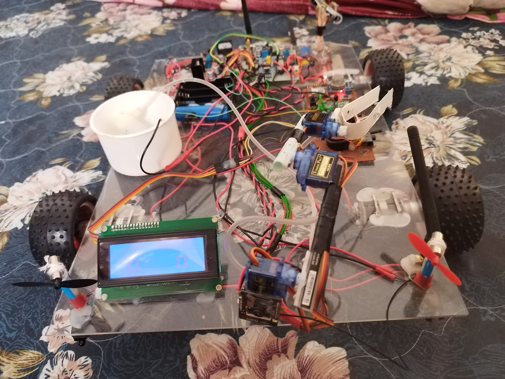
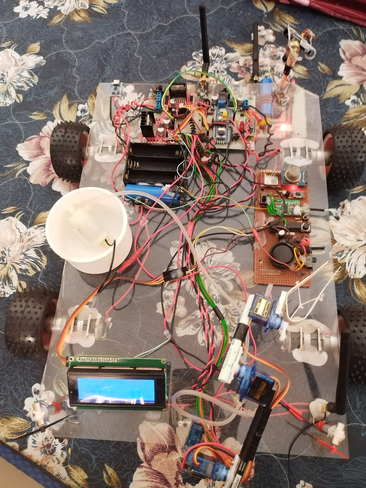

  <h1>🚒 FireFighter Robot with STM32, NRF24L01, ESP32-CAM</h1>

  
This is an open-source firefighting robot system that combines embedded systems, wireless communication, IoT, and robotics. The robot is capable of detecting fire, gas leaks, and hazardous environments while sending real-time video feedback. It also includes a 5-DOF robotic arm for pick-and-place tasks and a custom-built wireless controller.

  

    
  

  

    
  

  

  <h2>📦 Project Overview</h2>

  <h3>🤖 Main Robot Features</h3>
  <ul>
    <li><strong>MCU:</strong> STM32 (Main controller)</li>
    <li><strong>Wireless Video:</strong> ESP32-CAM for real-time video streaming</li>
    <li><strong>Wireless Communication:</strong> NRF24L01 module</li>
    <li><strong>Sensors:</strong>
      <ul>
        <li>Flame Sensor (fire detection)</li>
        <li>Gas Sensor (MQ-series)</li>
        <li>Oxygen Sensor</li>
      </ul>
    </li>
    <li><strong>Actuators:</strong>
      <ul>
        <li>5 Servo Motors (Robotic Arm)</li>
        <li>High-speed Fan (Fire extinguishing)</li>
        <li>800 RPM Gear Motor with Wheels (Locomotion)</li>
      </ul>
    </li>
    <li><strong>Communication Module:</strong> GSM for emergency alerts</li>
    <li><strong>Water Sprayer:</strong> For extinguishing fire</li>
  </ul>

  <h3>🎮 Remote Controller Features</h3>
  <ul>
    <li><strong>MCU:</strong> STM32</li>
    <li><strong>Wireless Communication:</strong> NRF24L01</li>
    <li><strong>Input Devices:</strong>
      <ul>
        <li>2-Axis Joystick (For movement)</li>
        <li>5 × 10k Potentiometers (For robotic arm control)</li>
        <li>Dedicated switches (Mode/Arm/Light/Fire)</li>
      </ul>
    </li>
    <li><strong>Custom PCB Design:</strong> Designed using Altium/EasyEDA</li>
  </ul>

  

  <h2>🧠 System Architecture</h2>
  <ul>
    <li><strong>Data Communication:</strong> Robot ↔ Remote via NRF24L01</li>
    <li><strong>Live Video Feed:</strong> ESP32-CAM over WiFi</li>
    <li><strong>Emergency Alert:</strong> SMS/Call via GSM</li>
    <li><strong>Power System:</strong> 12V battery + regulators for modules</li>
  </ul>

  

  <h2>🧰 Hardware Components</h2>
  <table>
    <thead>
      <tr>
        <th>Component</th>
        <th>Quantity</th>
        <th>Role</th>
      </tr>
    </thead>
    <tbody>
      <tr><td>STM32 Microcontroller</td><td>2</td><td>Robot + Remote Controller</td></tr>
      <tr><td>NRF24L01</td><td>2</td><td>Wireless communication</td></tr>
      <tr><td>ESP32-CAM</td><td>1</td><td>Video streaming</td></tr>
      <tr><td>Flame Sensor</td><td>1</td><td>Fire detection</td></tr>
      <tr><td>MQ Gas Sensor</td><td>1</td><td>Gas detection</td></tr>
      <tr><td>Oxygen Sensor</td><td>1</td><td>Environmental monitoring</td></tr>
      <tr><td>800RPM Gear Motor</td><td>2+</td><td>Locomotion</td></tr>
      <tr><td>Servo Motors (SG90/MG996R)</td><td>5</td><td>Robotic arm</td></tr>
      <tr><td>Joystick Module</td><td>1</td><td>Movement control</td></tr>
      <tr><td>10k Potentiometers</td><td>5</td><td>Robotic arm control</td></tr>
      <tr><td>GSM Module (SIM800L)</td><td>1</td><td>Alerts & messages</td></tr>
      <tr><td>High-Speed Fan</td><td>1</td><td>Fire extinguishing</td></tr>
      <tr><td>Custom Remote PCB</td><td>1</td><td>Manual control system</td></tr>
    </tbody>
  </table>

  

  <h2>🔧 Software Tools Used</h2>
  <ul>
    <li>STM32CubeMX / STM32CubeIDE</li>
    <li>Keil uVision</li>
    <li>Arduino IDE (for
